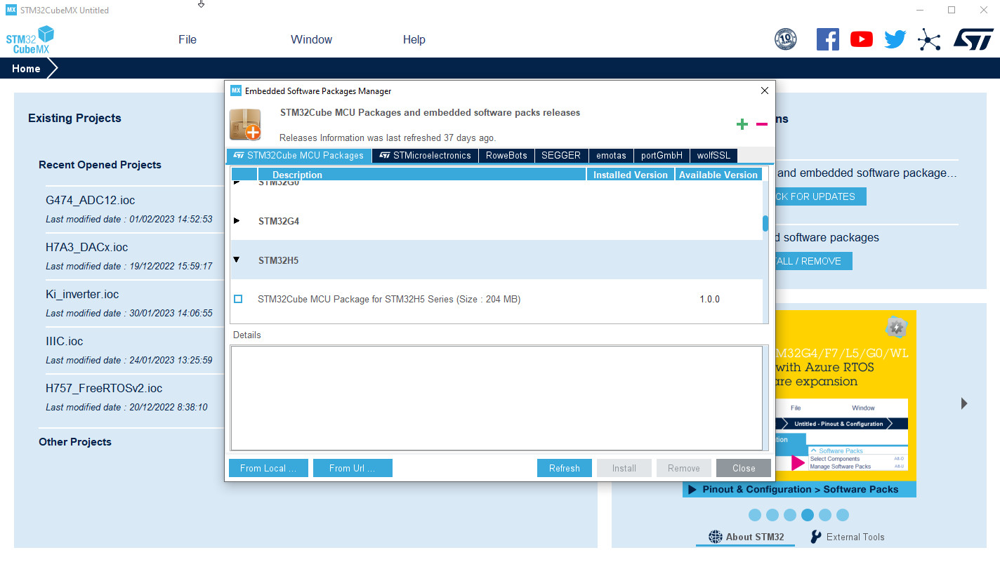
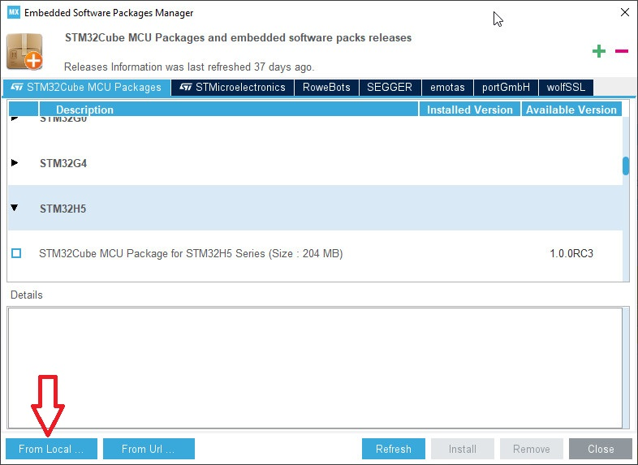
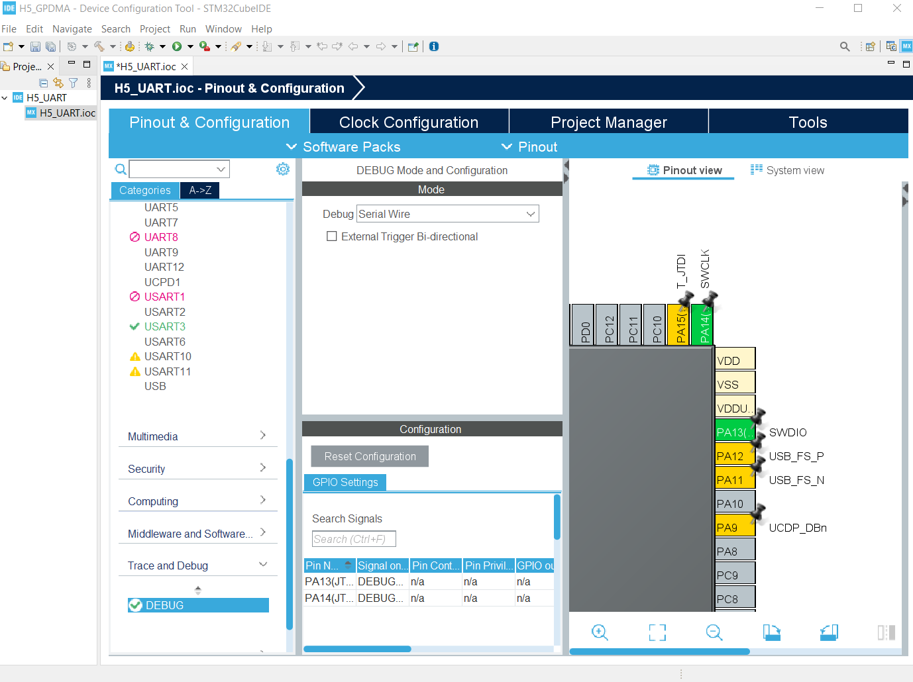
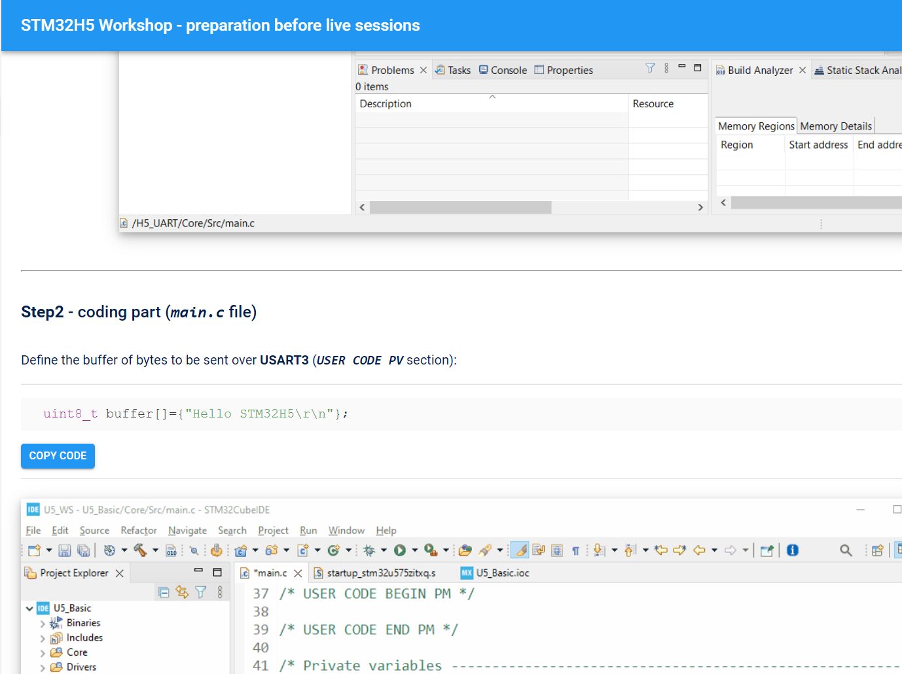
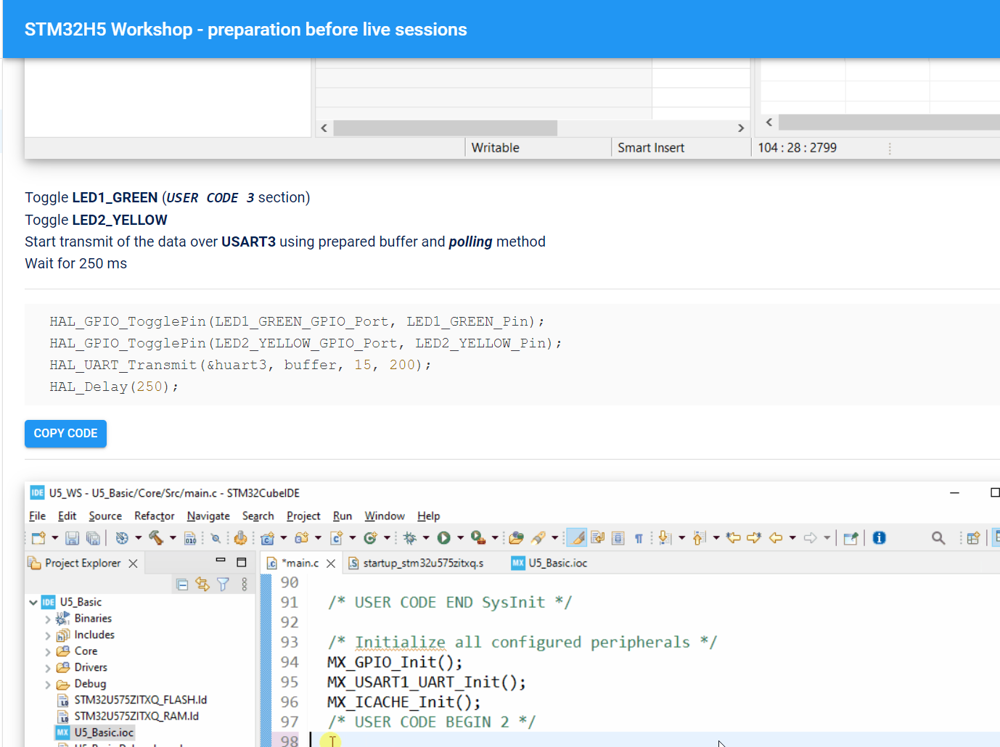
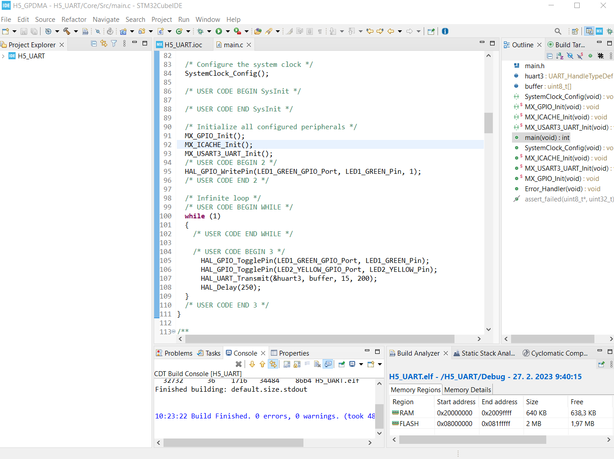

----!
Presentation
----!

# Introduction
## Dear Participant of STM32H5 Workshop,
<br>

Welcome to this short step-by-step guide which could help you to prepare to live version of STM32H5 Workshop session.

You will find here:

 - all information about prerequisites (software and hardware), 
 - short information about installation process, 
 - links to materials useful for this session

Additionally, in appendixes you can find some basic information about the board we will use durig the session and useful information about configuraiton and usage of STM32CubeIDE built in terminal
<br>

To navigate within this manual, please use navigation buttons:
<br>

  

<br>

In case of any questions / problems please contact us on [link](https://community.st.com)

See you on STM32H5 Workshop live session
<br>

## Yours,
## STMicroelectronics 
<br>

# Prerequisites
- Hardware:
  - **PC with MS Windows 10 operating system and admin rights granted**
  - **1 micro-USB** cable 
  <br>
  
  <br>
  - **[NUCLEO-STM32H563ZI](https://www.st.com/en/evaluation-tools/nucleo-h563zi.html)** Nucleo-144 development board 
  <br>
  
  <br>
- Software (PC with **MS Windows 10** operating system):
  - **[STM32CubeMX](https://www.st.com/en/development-tools/stm32cubemx.html)** in version 6.8.0
  - **[STM32CubeIDE](https://www.st.com/en/development-tools/stm32cubeide.html)** in version 1.12.0
  - **[STM32H5 Cube library](https://www.st.com/en/embedded-software/stm32cubeh5.html)** in version 1.0.0
  - **[Virtual COM port drivers](https://www.st.com/en/development-tools/stsw-stm32102.html)**
  - `[optionally]` any **terminal** application (can be used the one from STM32CubeIDE)
<br>

# Installation process
- download **STM32CubeMX** from [here](https://www.st.com/en/development-tools/stm32cubemx.html)
- install **STM32CubeMX** (if not yet done)
- download **STM32CubeIDE** from [here](https://www.st.com/en/development-tools/stm32cubeide.html)
- Install **STM32CubeIDE** (if not yet done)
- download and install **STM32H5 Cube library** (if not done yet):
  - run **STM32CubeMX**
  - go to `Help -> Manage Embedded Software Packages`
  - within package manager window find `STM32H5`, unroll it and select newest available version
  - press `install now`
<br>

<br>
- In case of library installation problems please try an alternative way:
  - download **STM32H5 Cube library** (.zip file)
  - run **STM32CubeMX**
  - go to `Help -> Manage Embedded Software Packages`
  - within package manager window use option `From local` 
<br>  

<br>

<ainfo>
STM32CubeMX and STM32CubeIDE are using the same repository by default, so installed STM32U5 Cube library will be visible in both tools.
</ainfo>


<br>
----


# Verification process before you visit us
The purpose of this part is checking whether all software components are installed properly.
<br>
Additionally prepared test project can be a base for next hands-on parts during the workshop.

## **STM32CubeIDE and STM32H5 Cube library**
<br>

----

<br>
**Task definition**
<br>

- Using STM32CubeIDE
  - Enable SWD for debug
  - Disable TrustZone
  - Configure ICACHE (in any of available modes)
- Select and configure USART3
  - in asynchronous mode,
  - using default settings (115200bps, 8D, 1stop bit, no parity) 
  - on PA9/PA10 pins
<br>

----

<br>
## **Step1** - project creation and peripherals configuration
 - Run **STM32CubeIDE**
 - Specify workspace location (i.e. `C:\_Work\H5_GPDMA`)
<br>

<br>
- Start new project using one of the below methods:
  - by selecting `File->New->STM32Project` 
  - by click on `Start new STM32 project` button
  <br>
  
<br>
- switch to **Board Selector** tab
- select NUCLEO-**H563**ZI board
- press `Next` button
- within STM32 Project window:
  - specify project name (i.e. `H5_UART`)
  - keep **enable TrustZone** option unchecked
  - press `Finish` button
  - on question pop-up window "Initialize all peripherals with their default state?" press `No` button 
  - on question pop-up window "Switch to proper CubeIDE perspective?", if it is showed, press `Yes` button 
  - on worning pop-up window "Do you still want a code generation?", press `No` button 
  - on following information pop-up window, it was our decision did not generate code, press `OK` button 
  <br>
   
<br>
- Peripherals configuration: Pinout&Configuration tab
- **ICACHE configuration** (System Core group)
  - select either 1-way or 2-ways (we will not focus on performance within this workshop)
  <br>
  
  <br>
- **USART3 configuration** (Connectivity group)
  - select Asynchronous mode
  - keep default settings in configuration:
    - Basic parameters: 115200bps, 8bits data, 1 stop bit, no parity
    - Pins assignment: PD8, PD9
    - no interrupts, no DMA usage
  <br>
    
<br>
- **SWD configuration** (Trace and debug group)
  - select Serial wire debug
  - this is usually not necessary, because of default state of SWD pins, but it is good habit to do it
  <br>
    
<br>
- **Project settings**
  - select `Project Manager` tab
  - check project location (.ioc file)
  - check project name
<br>
   
<br>
  - generate project by one of the ways:
    - by pressing "gear" icon
    - by select `Project->Generate Code`
    - by pressing **Alt+K**
<br>
  
<br>

----

<br>
## **Step2** - coding part (`main.c` file)
<br>
Define the buffer of bytes to be sent over **USART3** (`USER CODE PV` section):
<br>

```c
  uint8_t buffer[]={"Hello STM32H5\r\n"};
```

<br>

<br>
Turn on **LED1_GREEN** (`USER CODE 2` section):
<br>

```c
  HAL_GPIO_WritePin(LED1_GREEN_GPIO_Port, LED1_GREEN_Pin, 1);
```

<br>

<br>
Toggle **LED1_GREEN** (`USER CODE 3` section)
<br>
Toggle **LED2_YELLOW** 
<br>
Start transmit of the data over **USART3** using prepared buffer and ***polling*** method
<br>
Wait for 250 ms
<br>

```c
  HAL_GPIO_TogglePin(LED1_GREEN_GPIO_Port, LED1_GREEN_Pin);
  HAL_GPIO_TogglePin(LED2_YELLOW_GPIO_Port, LED2_YELLOW_Pin);
  HAL_UART_Transmit(&huart3, buffer, 15, 200);
  HAL_Delay(250);
```

<br>

<br>

----

<br>
## **Step 3** - build the project
- Build the project using `hammer` button or `Project->Built All` or **Ctrl+B**
<br>

<br>

<ainfo>
In case of neither errors nor warnings after this process, STM32CubeIDE and STM32U5 library are installed correctly. Last point - debug session will be verified during first hands on part on the workshop.
</ainfo>


<ainfo>
## **Congratulations** You have completed installation part. Now you are fully prepared for the live workshop session. 
</ainfo>

----


<br>

# **Appendix A** - configuration and start **STM32CubeIDE** built-in terminal  
<br>
### You can follow dedicated video on this topic [here from 8:50](https://www.youtube.com/watch?v=JWOV4j5fCS4&list=PLnMKNibPkDnFCosVVv98U5dCulE6T3Iy8&index=11&t=569s)

- Being in the debug session (debug perspective), please go to Console window (bottom part of the screen) 
- select `New -> 3 Command Shell Console` 
- specify `Connection Type` to **Serial Port**
- select **New** within `Connection name` (in case of previously configured connections you can select them from the list)
- in case of new connection, select its name (i.e. `Internal_Term`)
- select port number (used by STLink Virtual COM port - usually highest from the list)
- adapt communication parameters if needed (in our case default settings are inline with application ones)
- to confirm press `Finish`
- press `OK` on the next window
- After proper configuration, Console will contain terminal window (already connected)
- It is possible to disconnect the terminal, connect it or close it
<br>  
  

# Materials for the session
- Access to tools dedicated web pages:
  - [STM32CubeIDE](https://www.st.com/en/development-tools/stm32cubeide.html)
  - [STM32CubeMX](https://www.st.com/en/development-tools/stm32cubemx.html)
  - [STM32H5 Cube library](https://www.st.com/en/embedded-software/stm32cubeh5.html)
- [STM32 on-line training resources](https://www.st.com/content/st_com/en/support/learning/stm32-education/stm32-moocs.html)
- documentation
  - [STM32H563 datasheet](https://www.st.com/resource/en/datasheet/stm32h563zi.pdf)
  - [STM32H563 reference manual](https://www.st.com/resource/en/reference_manual/rm0456-stm32u575585-armbased-32bit-mcus-stmicroelectronics.pdf)
  - [NUCLEO-H563ZI-Q board schematics](https://www.st.com/resource/en/schematic_pack/mb1549-u575ziq-c03_schematic.pdf)


  Alternatively you can download complete set of offline materials from [this link](https://github.com/RRISTM/stm32u5_workshop/tree/master/material_pdf)

# Verification process at the begining of the session

  The purpose of this part is checking whether all software components can run with provided hardware boards.
  <br>
  **We will reuse the project prepared within homework part.**

- Please start STM32CubeIDE and open the project prepared before the session.
- Connect board to PC using micro-USB cable. Multicolor LED (right side of USB connector) should be turned on (red color)
<br>

<br>
- Start the debug session using `bug` icon or `Run->debug` or by pressing **F11**
- All the settings should be automatically set based on your compiled project. Press `OK` button
- At this moment you may see an information window that your STLink firmware is not up-to-date,
- please accept this message and perform automatic upgrade process
- disconnect and conect USB cable
<br>

<br>
- Once more start the debug session using `bug` icon or `Run->debug` or by pressing **F11**
- Select `Switch` within `Configure Perspective Switch` dialog which is informing about new (debug one) windows setup within STM32CubeIDE application.
- Start terminal application and run it for virtual COM port number assigned to the NUCLEO board with settings: 115200bps, 8bits data, 1 stop bit, no parity, no HW control. As an alternative you can use STM32CubeIDE built-in terminal (please have a look within Appendix for more details)
- run the application within debug session. As a result within terminal there should be "Hello STM32H5" messages displayed.
<br>

<br>
  <br>

<br>.

----

<ainfo>
 **Congratulations** You have completed varifictation part. Now you are fully prepared for next parts of this workshop session 
</ainfo>

----

